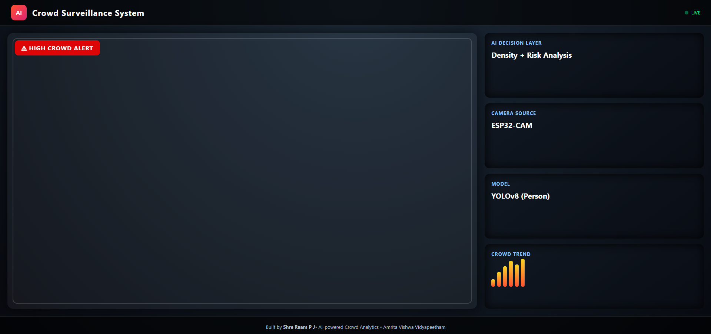
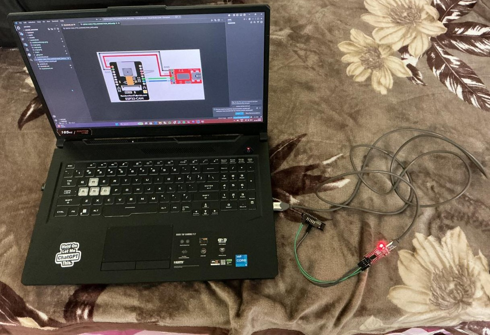

# Crowd Analyzer using ESP32-CAM + YOLOv8


## Project Overview

The **Crowd Analyzer** is an AI-powered smart monitoring system that combines **ESP32-CAM**, **Flask**, and **YOLOv8** to analyze crowd density in real time.

The system captures live images from an ESP32-CAM module, processes them using a YOLOv8 object detection model, generates a dynamic density heatmap, and displays the results through a dashboard interface.

This project was developed as a practical implementation of:

* Computer Vision
* AI-based people detection
* Real-time monitoring systems
* Smart surveillance concepts
* Edge device integration using ESP32-CAM

---

## Features

### Real-Time Crowd Detection

* Detects people using YOLOv8
* Counts crowd density dynamically
* Tracks crowd intensity over frames

### Heatmap Visualization

* Generates live crowd heatmaps
* Highlights dense areas visually
* Uses OpenCV color mapping

### ESP32-CAM Integration

* Wireless image transmission over WiFi
* Receives snapshots directly into Flask backend
* Lightweight IoT-based setup

### Crowd Alert System

* Detects persistent high crowd situations
* Displays overload warning alerts
* Frame-based crowd monitoring logic

### Dashboard Interface

* Live processed stream
* People count display
* Crowd level indicator
* Heatmap overlay visualization

---

## Tech Stack

| Technology | Purpose              |
| ---------- | -------------------- |
| Python     | Backend Logic        |
| Flask      | Web Server           |
| OpenCV     | Image Processing     |
| YOLOv8     | Person Detection     |
| ESP32-CAM  | Image Capture Device |
| NumPy      | Numerical Processing |
| HTML/CSS   | Dashboard UI         |

---

## System Architecture

```text
ESP32-CAM
     ↓
Captures Image Frames
     ↓
Flask Backend Receives Frames
     ↓
YOLOv8 Detects People
     ↓
Heatmap Generated Using OpenCV
     ↓
Crowd Level Analysis
     ↓
Dashboard Displays Output
```

---

## Project Structure

```text
Crowd-Anlayser-Esp32Cam/
│
├── backend/
│   ├── app.py
│   └── templates/
│
├── esp32/
│   └── camera_code.ino
│
├── models/
│   └── yolov8n.pt
│
├── screenshots/
│   ├── img1.jpeg
│   ├── img2.jpeg
│   └── img3.png
│
├── README.md
├── LICENSE.txt
└── CHANGELOG.txt
```

---

## Screenshots

### Dashboard View



```md

```

---

### Heatmap Detection


```md

```

---

### ESP32-CAM Setup



```md

```

---

## Demo Video

https://www.youtube.com/watch?v=WpYCNDZI0R0

```text
Demo Video Link: ____________________________
```

---

## Installation Guide

### Clone Repository

```bash
git clone https://github.com/SHRE-RAAM-P-J/Crowd-Anlayser-Esp32Cam.git
```

---

### Install Dependencies

```bash
pip install flask ultralytics opencv-python numpy
```

OR

```bash
pip install -r requirements.txt
```

---

### Download YOLOv8 Model

Place `yolov8n.pt` inside:

```text
models/
```

---

### Upload ESP32-CAM Code

* Open `camera_code.ino`
* Configure:

  * WiFi SSID
  * WiFi Password
  * Flask Server IP
* Upload code using Arduino IDE

---

### Run Flask Backend

```bash
cd backend
python app.py
```

---

## Crowd Logic

| People Count | Crowd Level |
| ------------ | ----------- |
| 0            | LOW         |
| 1-2          | MEDIUM      |
| 3+           | HIGH        |

When high crowd frames continuously exceed a threshold, the system triggers an overload alert.

---

## Real-World Applications

* Smart supermarkets
* Mall crowd monitoring
* Queue management systems
* Smart city surveillance
* Public safety analytics
* Retail customer flow analysis

---

## Challenges Faced


1️. ESP32-CAM Streaming Instability

One major challenge was maintaining stable image transmission from the ESP32-CAM to the Flask backend. Direct MJPEG streaming caused browser rendering issues and unstable performance, so the architecture was redesigned to use periodic image uploads instead.

2. Real-Time Processing Limitations

Running YOLOv8 person detection in real time on CPU introduced latency and reduced frame rates. Balancing detection accuracy, image resolution, and processing speed required multiple optimizations.

3️. Network Communication Issues

The ESP32-CAM and Flask server initially failed to communicate due to IP mismatches, incorrect ports, and local network configuration problems. Proper synchronization between devices on the same WiFi network was necessary for stable operation.

4️. Heatmap Generation Optimization

Generating dynamic crowd density heatmaps while continuously processing frames increased computational overhead. Optimizing OpenCV blending and heatmap accumulation logic was necessary to maintain smoother performance.

5️. Handling Hardware Constraints

The ESP32-CAM has limited processing power and memory, making high-resolution real-time streaming difficult. Several frame size and JPEG quality adjustments were tested to achieve a balance between speed and image quality.

6️. Synchronization Between AI Processing and Streaming

Maintaining synchronization between uploaded frames, YOLO detection, heatmap updates, and frontend streaming required careful handling of shared frame buffers and threading logic inside Flask.

7️. Frontend Integration Challenges

Integrating the live processed stream into the dashboard UI required debugging Flask routes, HTML rendering, and stream handling to ensure the frontend updated correctly in real time.

Example ideas:

* ESP32 streaming limitations
* MJPEG streaming issues
* Browser rendering problems
* Real-time heatmap optimization
* Frame synchronization challenges
* Hardware power stability

---

## Learning Outcomes

Through this project, I learned:

* Real-time computer vision integration
* Flask backend streaming
* YOLOv8 object detection workflow
* ESP32-CAM communication
* Heatmap generation using OpenCV
* Building AI + IoT hybrid systems

---

## Future Improvements

* Multi-camera support
* Cloud dashboard deployment
* Mobile app integration
* Database analytics storage
* Email/SMS crowd alerts
* Advanced AI analytics
* CCTV camera compatibility

---

## Author

**SHRE RAAM P J**

* GitHub: [https://github.com/SHRE-RAAM-P-J](https://github.com/SHRE-RAAM-P-J)
* LinkedIn: [https://www.linkedin.com/in/shre-raam/](https://www.linkedin.com/in/shre-raam/)
* Email: [shreraam007@gmail.com](mailto:shreraam007@gmail.com)

---

## ⭐ Support

If you found this project interesting, consider giving it a ⭐ on GitHub.
